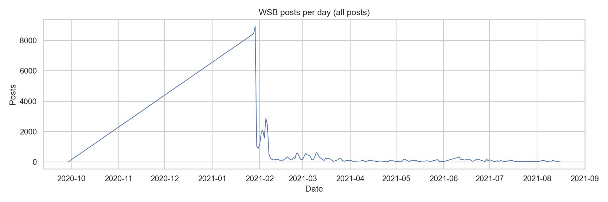
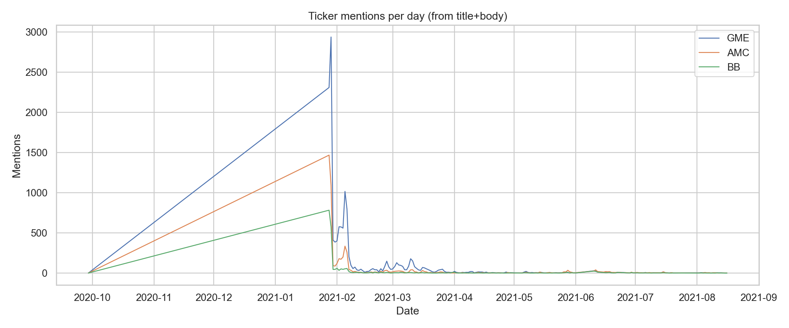

# DSA210 Project (Spring 2025-2026) — WSB vs Meme Stocks

This repo contains the **data collection (enrichment), EDA, and hypothesis tests** for the DSA210 term project:
**"The Pulse of WallStreetBets: Analyzing the Impact of Social Media Discussion Volume on Stock Market Volatility and Trading Volume"**.

## Motivation
The 2021 “meme stock” period raised a practical question: **can social-media attention act as an indicator of market activity?**
This project investigates whether **discussion volume on r/wallstreetbets** (mentions, post counts, and engagement) is associated with (and potentially leads) changes in:
- **Trading volume**
- **Volatility** (proxied with daily return-based measures)

## Data
- **Reddit posts**: `reddit_wsb.csv` (Kaggle / G. Preda dataset format)
- **Market enrichment**: downloaded via `yfinance` and cached under `data/market_<TICKER>.csv`

## Methodology (14 April checkpoint scope)
- **Cleaning / preparation**
  - Parse timestamps (`created` Unix epoch; fallback to `timestamp`)
  - Extract ticker mentions (regex on `title + body`)
  - Aggregate to **daily** time series (`posts`, `mentions_<TICKER>`, score aggregates)
- **Enrichment**
  - Download daily OHLCV using `yfinance` for selected tickers (default: GME/AMC/BB)
  - Join on date and create **next-day targets** (e.g., `vol_next`, `absret_next`)
- **EDA**
  - Time-series plots for posts/mentions
  - Scatter plots: mentions vs next-day volume / next-day |return|
- **Hypothesis testing**
  - Mann–Whitney U: compare **high-attention days** (top 25% mentions) vs others
  - Spearman correlation: mentions vs next-day targets

### Data preparation details
- Converted post time to UTC datetime using `created` (Unix epoch). If missing, used parsed `timestamp`.
- Extracted ticker mentions from `title + body` using a regex and counted daily mentions per ticker.
- Aggregated Reddit posts to daily level:
  - `posts` (number of posts/day)
  - `score_sum`, `score_mean`
  - `mentions_GME`, `mentions_AMC`, `mentions_BB`
- Joined daily Reddit aggregates with daily market data by date.
- Created **next-day** market targets to test “leading indicator” effects:
  - `vol_next` = next-day trading volume
  - `absret_next` = next-day absolute close-to-close return
  - `hl_next` = next-day high-low range scaled by close

### EDA outputs
- WSB activity over time: `outputs/figures/posts_per_day.png`
- Daily mentions for GME/AMC/BB: `outputs/figures/mentions_per_day.png`
- Scatter + regression (per ticker):
  - `outputs/figures/<TICKER>_mentions_vs_nextday_volume.png`
  - `outputs/figures/<TICKER>_mentions_vs_nextday_abs_return.png`

## Setup

```bash
python -m venv .venv
# Windows PowerShell:
.venv\Scripts\Activate.ps1
pip install -r requirements.txt
```

## Run (EDA + hypothesis tests)

```bash
python -m src.run_eda_hypothesis --reddit_csv reddit_wsb.csv --tickers GME AMC BB
```

Outputs:
- Figures saved under `outputs/figures/`
- Summary tables and test results saved under `outputs/tables/`

## Notebook (step-by-step)
For a cell-by-cell, “how it was done” view (imports → cleaning → enrichment → plots → tests), open:
- `dsa210_analysis.ipynb`

## Key findings (current checkpoint)
- **Next-day trading volume** tends to be higher after days with high WSB attention (mentions), across GME/AMC/BB (see `outputs/tables/hypothesis_tests.csv`).
- **Next-day volatility** (|return|) shows a weaker/mixed relationship: significant for some tickers, not for all.
- These results are **correlational**; they do not imply causality.

### Hypothesis test summary (p-values)
From `outputs/tables/hypothesis_tests.csv`:
- **H1 (High mentions → higher next-day volume)**: significant for **GME** (\(p=3.00\times 10^{-13}\)), **AMC** (\(p=4.76\times 10^{-6}\)), **BB** (\(p=2.39\times 10^{-11}\)).
- **H2 (High mentions → higher next-day volatility \(|r|\))**: significant for **GME** (\(p=0.0201\)) and **AMC** (\(p=0.0217\)); **BB** not significant (\(p=0.146\)).
- **H3 (Spearman: mentions vs next-day volume)**: significant positive correlation for **GME** (ρ=0.798, \(p=5.62\times 10^{-28}\)), **AMC** (ρ=0.485, \(p=1.74\times 10^{-8}\)), **BB** (ρ=0.702, \(p=3.07\times 10^{-19}\)).
- **H3b (Spearman: mentions vs next-day \(|r|\))**: significant for **GME** (ρ=0.354, \(p=6.95\times 10^{-5}\)) and **BB** (ρ=0.240, \(p=0.00793\)); **AMC** not significant (\(p=0.063\)).

## Limitations (for this stage)
- Mention extraction is regex-based and may include false positives / miss context (e.g., abbreviations).
- Using daily aggregation hides intraday dynamics.
- Next-day relationships are correlational; no causal claims.
- Only 2020-09 to 2021-08 is covered by this Reddit CSV.

## Example figures



## Notes on reproducibility
- Market data is **cached**. Re-running will reuse cached `data/market_<TICKER>.csv` unless `--refresh_market` is passed.
- The analysis aggregates Reddit posts to **daily** time series and joins with daily market data.

## Project structure
```
DSA210_project/
├── dsa210_analysis.ipynb
├── src/
│   └── run_eda_hypothesis.py
├── data/
│   └── market_<TICKER>.csv
├── outputs/
│   ├── figures/
│   └── tables/
├── requirements.txt
└── README.md
```

## Academic Integrity (AI usage disclosure)
This project is an original work prepared for **DSA 210 – Introduction to Data Science** (Sabancı University).

AI tools were used as a **coding assistant** for:
- Assistance in organizing the repository architecture and ensuring a reproducible workflow
- Debugging the EDA + hypothesis testing pipeline
- Improving the clarity of written explanations and formatting the final report.

All results were reviewed and are reproducible by running the code in this repository.
